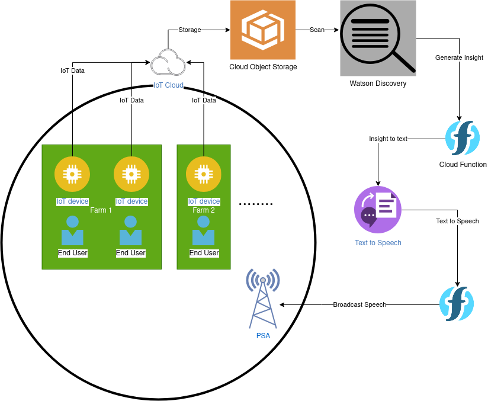
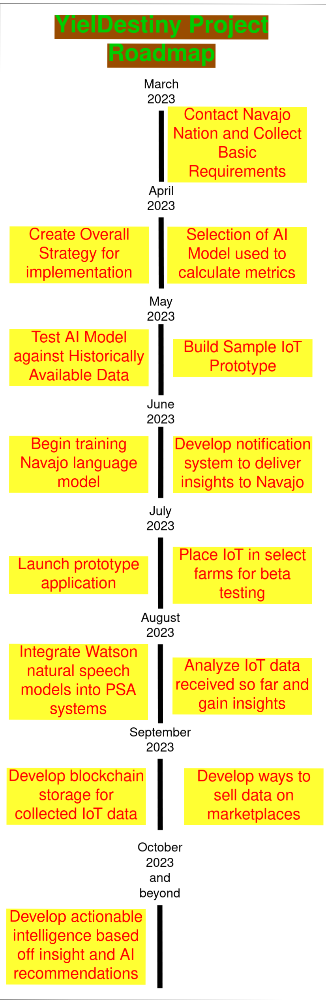

# Call for Code Submission - YielDestiny

- [Project summary](#project-summary)
  - [The issue we are hoping to solve](#the-issue-we-are-hoping-to-solve)
  - [How our technology solution can help](#how-our-technology-solution-can-help)
  - [Our idea](#our-idea)
- [Technology implementation](#technology-implementation)
  - [IBM AI service(s) used](#ibm-ai-services-used)
  - [Other IBM technology used](#other-ibm-technology-used)
  - [Solution architecture](#solution-architecture)
- [Presentation materials](#presentation-materials)
  - [Solution demo video](#solution-demo-video)
  - [Project development roadmap](#project-develop)

## Project summary

### The issue we are hoping to solve

- Farmers and the populace in general of the Navajo Nation which occupies portions of New Mexico, Arizona and Utah are currently undergoing what has been called a "100-year drought" caused by climate change which has affected crop yields.

- They live without electricity for several hours a day and many have to drive several miles to pick up water from water sources as current water sources have dried out or become infrequent due to the drought.

- The people of the Navajo Nation are underrepresented, underfunded and have faced the brunt of the effects of climate change without any data or resources to help them adapt to the new realities set before them.

### How our technology solution can help

- Use IBM AI to empower the Navajo and help them adapt.

### Our idea

The current weather stations and water measurment technologies used by the Navajo Nation cannot keep up with the changing climate, nor can they properly integrate with the community and reach all of the members in the community to communicate the significance of their findings. We want to use the data from these pre-exisitng infrastructures as well as from other governement and academic bodies that collect this kind of data in order to create a machine learning model that can compare historical data and trends with current data and produce meaningful information that can help farmers and other residents improve their lives in the current climate. It will also use translation and text-to-speech services in order to broadcast PSAs to the Navajo Nation in their native language regarding weather, climate or water scarcity problems that it might detect.

Another step of the plan would eventually be to place smaller IoT (Internet of Things) devices on several farms and key indicative areas in the reservation in order to have even more specific data on the Nation's climate. In addition to this, farmers will also be able to pool data collected from their farms as a data warehouse dataset encoded on a blockchain system whose data can be sold with the revenue from the sales being distributed back to the farmers. This would empower farm owners and educate them on the world of big data while simultaneously increasing their revenue streams and optimizing the yield of their crops through further analysis of historical data year-on-year.

## Technology implementation

### IBM AI Services Used

- IBM Text to Speech: Convert notifications into speech over PSAs.
- Watson Discovery: Discover insights in collected data which humans may not be able to find.

### Other IBM Technology Used

- IBM Cloud Functions: Implementation of microservices for data gathering and notifications.
- IBM Cloud Object Storage: Mass storage of current and historical data in a data lake.
- IBM IoT Platform: To configure and collect data from Internet of Things devices.

### Solution Architecture

1. IoT devices on farms transfer relevant data to IBM IoT which stores them in Cloud Object Storage
2. Watson Discovery uses data to generate important insights.
3. Insights are broadcast using IBM Text to Speech to build speeches broadcast over a PSA.

## Presentation materials

### Solution demo video

### Project development roadmap

